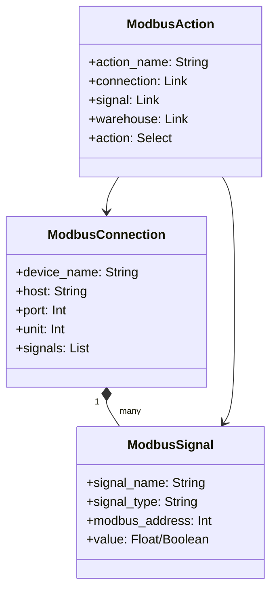

# EpiBus Integration Guide

EpiBus is the industrial automation app that bridges ERPNext business processes with MODBUS-enabled PLCs and industrial devices.

## Overview

EpiBus provides:
- **MODBUS TCP Communication**: Connect to PLCs, sensors, and actuators
- **ERP Integration**: Link business events to industrial actions
- **Real-time Monitoring**: Live data exchange between ERP and field devices
- **Automation Workflows**: Trigger PLC operations from ERPNext documents

## Architecture

### Core Components



### Event Flow

1. **ERPNext Document Event** (e.g., Stock Entry submission)
2. **Server Script Execution** (triggered by document event)
3. **MODBUS Action Processing** (read/write to PLC)
4. **Signal Update** (real-time data exchange)
5. **Result Feedback** (update ERP with device status)

## Getting Started

### 1. Access EpiBus

After logging into IntralogisticsAI:
1. Navigate to the **EpiBus** workspace in the sidebar
2. You'll see modules for Connections, Signals, and Actions

### 2. Configure MODBUS Connection

**Create New Connection:**
1. Go to **MODBUS Connection** → **New**
2. Fill in connection details:
   - **Device Name**: `CODESYS Simulator` or `Production Line PLC`
   - **Host**: `codesys` (simulator) or `192.168.1.200` (real PLC)
   - **Port**: `502` (standard MODBUS TCP port)
   - **Unit**: `1` (device unit ID)

**Test Connection:**
```python
# Test connectivity in EpiBus
connection = frappe.get_doc("Modbus Connection", "CODESYS Simulator")
result = connection.test_connection()
print(f"Connection status: {result}")
```

### 3. Define MODBUS Signals

**Digital Input Example:**
- **Signal Name**: `Conveyor_Sensor_01`
- **Signal Type**: `Digital Input`
- **MODBUS Address**: `0`
- **PLC Address**: `%IX0.0`

**Digital Output Example:**
- **Signal Name**: `Conveyor_Motor_01`
- **Signal Type**: `Digital Output`
- **MODBUS Address**: `0`
- **PLC Address**: `%QX0.0`

**Analog Input Example:**
- **Signal Name**: `Temperature_Sensor`
- **Signal Type**: `Analog Input`
- **MODBUS Address**: `0`
- **PLC Address**: `%IW0`

### 4. Create Automation Actions

**Example: Warehouse-triggered PLC Action**
1. Go to **MODBUS Action** → **New**
2. Configure action:
   - **Action Name**: `Activate Bin 001 Conveyor`
   - **Connection**: `CODESYS Simulator`
   - **Signal**: `Conveyor_Motor_01`
   - **Action**: `Write`
   - **Bit Value**: `1` (turn on)
   - **Warehouse**: `Bin 001`

This action will activate the conveyor motor when items are moved from Bin 001.

## MODBUS Function Codes

### Standard Function Codes
| Code | Description | Direction | Data Type |
|------|-------------|-----------|-----------|
| 1 | Read Coils | Read | Digital Output |
| 2 | Read Discrete Inputs | Read | Digital Input |
| 3 | Read Holding Registers | Read | Analog Output |
| 4 | Read Input Registers | Read | Analog Input |
| 5 | Write Single Coil | Write | Digital Output |
| 6 | Write Single Register | Write | Analog Output |

### Address Mapping
```
CODESYS Variable → MODBUS Address
%IX0.0           → Address 0 (Digital Input)
%QX0.0           → Address 0 (Digital Output)  
%IW0             → Address 0 (Analog Input)
%QW0             → Address 0 (Analog Output)
```

## Programming Examples

### Read PLC Data
```python
# In a Frappe script or method
def read_conveyor_status():
    \"\"\"Read conveyor sensor status\"\"\"
    connection = frappe.get_doc("Modbus Connection", "CODESYS Simulator")
    signal = frappe.get_doc("Modbus Signal", "Conveyor_Sensor_01")
    
    # Read digital input
    value = connection.read_signal(signal)
    
    # Log the reading
    frappe.log_error(f"Conveyor sensor reading: {value}")
    
    return value
```

### Control PLC Output
```python
# Stock Entry event handler
def on_stock_entry_submit(doc, method):
    \"\"\"Trigger PLC action on stock movement\"\"\"
    for item in doc.items:
        if item.s_warehouse == "Bin 001":
            # Activate conveyor for items leaving Bin 001
            connection = frappe.get_doc("Modbus Connection", "CODESYS Simulator")
            signal = frappe.get_doc("Modbus Signal", "Conveyor_Motor_01")
            
            # Write to PLC
            connection.write_signal(signal, True)
            
            # Log the action
            frappe.log_error(f"Activated conveyor for item {item.item_code}")
```

### Scheduled Monitoring
```python
# Scheduled job to monitor PLC status
@frappe.whitelist()
def monitor_plc_status():
    \"\"\"Periodic PLC monitoring\"\"\"
    connections = frappe.get_all("Modbus Connection", 
                                filters={"enabled": 1})
    
    for conn in connections:
        connection = frappe.get_doc("Modbus Connection", conn.name)
        
        # Read all signals for this connection
        for signal in connection.signals:
            try:
                value = connection.read_signal(signal)
                
                # Update signal value
                signal_doc = frappe.get_doc("Modbus Signal", signal.name)
                signal_doc.value = value
                signal_doc.save()
                
            except Exception as e:
                frappe.log_error(f"Error reading {signal.name}: {str(e)}")
```

## Integration Scenarios

### 1. Automated Warehouse Operations
- **Trigger**: Stock Entry submission
- **Action**: Activate conveyor/sorting systems
- **Result**: Physical movement matches ERP transactions

### 2. Quality Control Integration
- **Trigger**: Quality Inspection creation
- **Action**: Read sensor data from inspection station
- **Result**: Automatic pass/fail based on sensor readings

### 3. Production Line Monitoring
- **Trigger**: Work Order status change
- **Action**: Monitor production line sensors
- **Result**: Real-time production tracking in ERP

### 4. Environmental Monitoring
- **Trigger**: Scheduled job (every 5 minutes)
- **Action**: Read temperature, humidity sensors
- **Result**: Environmental data logged in ERP

## Troubleshooting

### Connection Issues
```bash
# Test MODBUS connectivity
telnet localhost 502

# Check from container
docker compose exec backend python3 -c "
from pymodbus.client import ModbusTcpClient
client = ModbusTcpClient('codesys', 502)
print('Connected:', client.connect())
"
```

### Debug Signal Reading
```python
# Debug signal configuration
def debug_signal(signal_name):
    signal = frappe.get_doc("Modbus Signal", signal_name)
    connection = frappe.get_doc("Modbus Connection", signal.connection)
    
    print(f"Signal: {signal.signal_name}")
    print(f"Type: {signal.signal_type}")
    print(f"Address: {signal.modbus_address}")
    print(f"Connection: {connection.host}:{connection.port}")
    
    # Test read
    try:
        value = connection.read_signal(signal)
        print(f"Current value: {value}")
    except Exception as e:
        print(f"Error: {str(e)}")
```

### Common Issues

**Connection Timeout:**
- Verify PLC IP address and port
- Check network connectivity
- Ensure PLC MODBUS server is running

**Wrong Data Values:**
- Verify MODBUS address mapping
- Check function code (1-4 for read operations)
- Confirm PLC variable assignment

**Action Not Triggering:**
- Check document event hooks
- Verify warehouse linkage in MODBUS Action
- Review server script execution logs

## API Reference

### MODBUS Connection Methods
```python
connection = frappe.get_doc("Modbus Connection", "device_name")

# Test connectivity
connection.test_connection()

# Read signal value
value = connection.read_signal(signal_doc)

# Write signal value
connection.write_signal(signal_doc, value)
```

### MODBUS Signal Methods
```python
signal = frappe.get_doc("Modbus Signal", "signal_name")

# Validate signal configuration
signal.validate()

# Toggle boolean output (for digital outputs)
signal.toggle_location_pin()
```

---

**Next Steps**: 
- See [CODESYS Guide](../codesys/README.md) for PLC programming
- Check [Lab Setup](../deployment/lab-setup.md) for multi-device configuration
- Review [API Documentation](api.md) for advanced integration