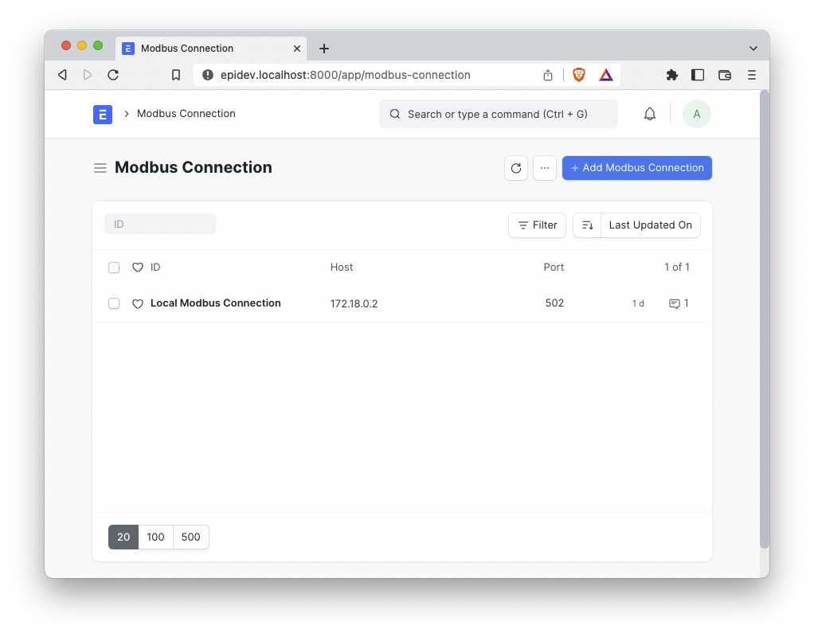

# EpiBus - MODBUS/TCP integration for ERPNext

**EpiBus** provides an ERPNext integration with MODBUS/TCP networked programmable logic controllers (PLC).

A Programmable Logic Controller, or PLC, is a hardware device used to control machines and processes. It is a computer that is designed to be used in harsh environments. It is used to control machines and processes in manufacturing, oil and gas, water treatment, and many others.

MODBUS is a communication protocol that is used to communicate with PLCs. It is a master-slave protocol, where the master is the computer that is used to communicate with the PLC, and the slave is the PLC itself.  

Note that the MODBUS protocol has been around since 1979 before the words "master" and "slave" in the context of machinery were considered offensive. The MODBUS protocol is still used today and is the most common protocol used to communicate with PLCs.

The name "EpiBus" is a portmanteau of "Epi" (from "Epinomy") and "Bus" (from "MODBUS"). 


EpiBus is based on the excellent [PyModbus library](https://pymodbus.readthedocs.io/en/latest/readme.html), which is a pure Python implementation of the MODBUS protocol.

## Installation

1. Install the app from the bench

```bash
bench get-app epibus
bench --site site1.local install-app epibus
```

2. Restart the bench

```bash
bench restart
```

EpiBus will install the following dependencies:
- pymodbus
- pygments
- pyserial_asyncio

## Usage Overview

EpiBus configures three DocTypes: **Modbus Connection**, **Modbus Signal**, and **Modbus Action**.

### Modbus Connection

A **Modbus Connection** is a configuration for a MODBUS/TCP connection. It contains the following fields:

- **Host**: The IP address or hostname of the PLC
- **Port**: The port number of the PLC (default is 502)
- **Device Name**: The brand and model name of the device (for reference only)
- **Unit**: The MODBUS unit ID of the device
- **Locations**: A list of **Modbus Signal**s that are associated with this connection.

### Modbus Signal

A **Modbus Signal** is a child DocType of **Modbus Connection**. It is used to map from the proprietary name of the location to the standard IEC 61131-3 name and the integer MODBUS address. It contains the following fields:

- **Device Address**: The name of the I/O pin on the PLC. This is specific to the brand and model of the PLC. For reference only.
- **PLC Address**: The standardized IEC 61131-3 address of the I/O pin on the PLC.
- **Modbus Address**: The MODBUS address of the I/O pin on the PLC. (See information below)
- **Location Type**: The type of I/O pin on the PLC. (See information below)

[Read More](docs/modbus_signal.md)

### Modbus Action

A **Modbus Action** provides an interface between ERPNext and the MODBUS/TCP connection. It executes a MODBUS read or write operation on a **Modbus Signal** and can be triggered from any ERPNext DocType that is linked to a **Modbus Action**. It contains the following fields:
    
- **Modbus Connection**: The **Modbus Connection** that this action will use.
- **Modbus Signal**: The **Modbus Signal** that this action will use.
- **Action Type**: The type of action that this action will perform. (See information below)
- **Value**: The value that will be written to the **Modbus Signal**. (Only used for write actions)

[Read More](docs/modbus_action.md)

## Creating a Modbus Connection

1. In the Awesome Bar, search for "Modbus Connection List" and click on the result.
2. Click the **+ Add Modbus Connection** button.

1. Enter the following information:
    - **Name**: A unique name for this connection. You can connect to any number of PLCs with this app.
    - **Host**: The IP address or hostname of the PLC
    - **Port**: The port number of the PLC
    - **Device Name**: The brand and model name of the device (for reference only)
    - **Unit**: The MODBUS unit ID of the device (defaults to 1)
2. Click the **Save** button.

3. Test the connection by clicking the **Test Connection** button. If the connection is successful, you will see a message that says "Connection successful". If the connection is unsuccessful, you will see a message that says "Connection failed".

4. Click the **Add Row** button in the **Locations** table.
5. For each I/O pin on the PLC, enter the following information:
    - **Device Address**: The name of the I/O pin on the PLC. For reference only.
    - **PLC Address**: The standardized IEC 61131-3 address of the I/O pin on the PLC.
    - **Modbus Address**: The MODBUS address of the I/O pin on the PLC. (See information below)
    - **Location Type**: The type of I/O pin on the PLC. (See information below)
6. Click the **Save** button again.

## Input, Output, and Memory Addressing


PLC applications interact with the external world through Input and Output modules and/or SCADA communication protocols. When designing your PLC applications, you decide which variables should be attached to I/O and communication modules by labeling the variable with a PLC address.


- **I** for input
- **O** for output
- **M** for memory

The following size prefixes are supported:

- **X** for bit (1 bit)
- **B** for byte (8 bits)
- **W** for word (16 bits)
- **D** for double word (32 bits)
- **L** for long word (64 bits)

For example, if you want to read the state of the first digital input into a BOOL variable, you must declare your variable located at: %IX0.0. If you want to write the contents of a UINT variable into the second analog output, you should declare your UINT variable located at %QW2.

**Note**: PLC to physical I/O mapping is platform dependent. For more information on PLC I/O mapping for every supported platform, check: 2.4 Physical Addressing

As you probably have noticed, bit (X) PLC addresses have a two-part hierarchical address. The least significant part (right-most) can be interpreted as a position in a byte and must be in the range 0 to 7. The most significant part (left-most) must be no more than 1023. Parts are separated by a single period. Data sizes other than X have a one-part hierarchical address. They must not contain a period (.) and must be no more than the maximum memory location address for your platform.


- **%IX0.8** The least significant index is greater than 7.
- **%QX0.0.1** Three-part hierarchy is not permitted address.
- **%IB1.1** Two-part hierarchy is only allowed for X data size.

## Example Pinout Configuration for a Modbus Connection
Below is an example pinout from the **Controllino Maxi Automation** PLC. It is from the 

```
/************************PINOUT CONFIGURATION*************************
Digital In:  AI2, AI3, AI4, AI5, AI6, AI7, AI8, AI9     (%IX0.0 - %IX0.7)
             AI10, AI11, DI0, DI1, DI2, DI3, IN0, IN1   (%IX1.0 - %IX1.7)

Digital Out: DO0, DO1, DO2, DO3, DO4, DO5, DO6, DO7     (%QX0.0 - %QX0.7)
             R0, R1, R2, R3, R4, R5, R6, R7             (%QX1.0 - %QX1.7)
             R8, R9                                     (%QX2.0 - %QX2.1)

Analog In:   AI0, AI1, AI13, AI13                       (%IW0 - %IW3)

Analog Out:  AO0, AO1                                   (%QW0 - %QW1)
*********************************************************************/
```


## License

MIT

Epinomy&reg; is a registered trademark of Applied Relevance, LLC.