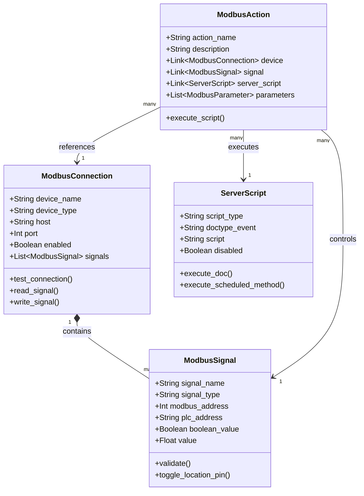
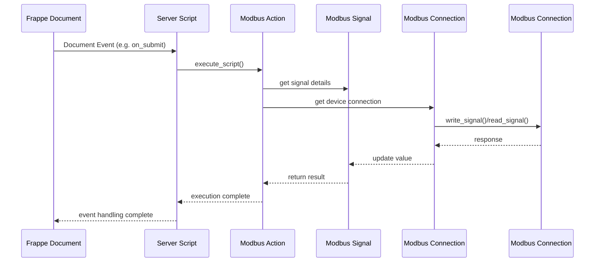
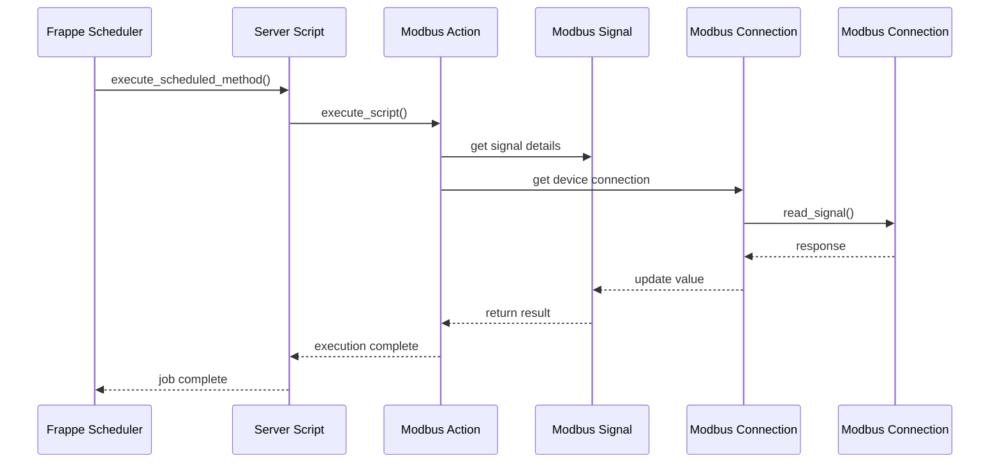

# EpiBus Architecture Documentation

## Overview

EpiBus provides integration between ERPNext's document events and MODBUS TCP devices through a system of coordinated components. This document outlines the relationships and interactions between these components.

## Component Relationships



## Event Flow - Document Triggered Action

The following diagram shows how a Frappe document event flows through the system to trigger a MODBUS action:



## Scheduler Flow - Time Triggered Action

For scheduled operations, the flow is slightly different:



## Key Concepts

1. **ModbusConnection**: Represents a physical MODBUS TCP device with connection details and signal definitions
2. **ModbusSignal**: Defines a specific I/O point on a Modbus Connection with addressing and type information
3. **ModbusAction**: Links Frappe events to MODBUS operations through configurable server scripts
4. **ServerScript**: Contains the Python code that defines the logic for how document events translate to MODBUS operations

## Usage Examples

### Document Event Handler

```python
# Server Script for Stock Entry submission
if doc.docstatus == 1:  # On Submit
    modbus_context = frappe.flags.modbus_context
    signal = modbus_context.get("signal")

    # Toggle output based on warehouse
    if "Bin 001" in [item.s_warehouse for item in doc.items]:
        signal.toggle_location_pin()
```

### Scheduled Reading

```python
# Server Script for periodic monitoring
modbus_context = frappe.flags.modbus_context
signal = modbus_context.get("signal")
device = modbus_context.get("device")

# Read current value
value = device.read_signal(signal)

# Create log entry
frappe.get_doc({
    "doctype": "Modbus Log",
    "signal": signal.name,
    "value": value,
    "timestamp": frappe.utils.now()
}).insert()
```
